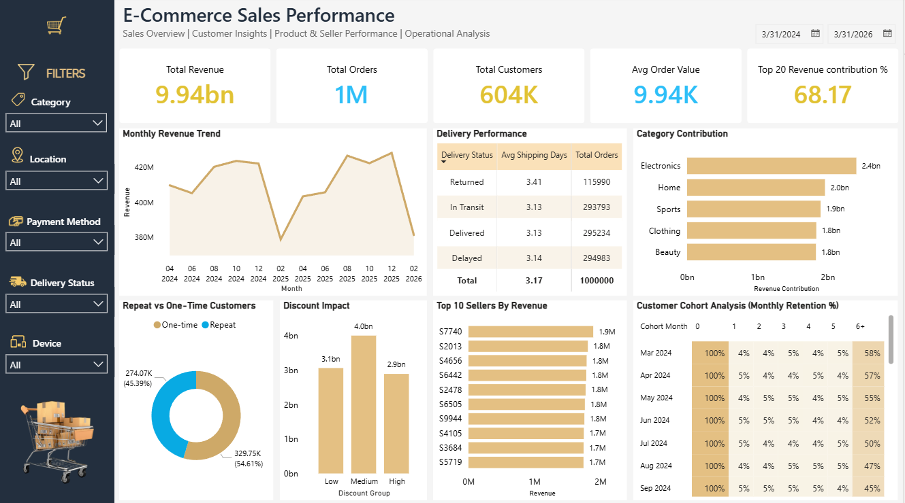

<h1 align="center">🛒 E-Commerce Sales Performance Analysis (SQL + Power BI)</h1>

  <b>An end-to-end business intelligence project analyzing e-commerce sales, customer behavior, seller performance, and operational efficiency using PostgreSQL and Power BI.</b>

  
  
  

<h2>🔗 Table of Contents</h2>

<ul>
  <li><a href="#brief-one-line-summary">🪄 Brief One-Line Summary</a></li>
  <li><a href="#overview">📝 Overview</a></li>
  <li><a href="#problem-statement">❓ Problem Statement</a></li>
  <li><a href="#dataset">📊 Dataset</a></li>
  <li><a href="#tools--technologies">⚙ Tools & Technologies</a></li>
  <li><a href="#methods">🧮 Methods</a></li>
  <li><a href="#key-insights">💡 Key Insights</a></li>
  <li><a href="#dashboard--output">📊 Dashboard / Output</a></li>
  <li><a href="#sql-analysis-highlights">🗄 SQL Analysis Highlights</a></li>
  <li><a href="#project-links">🔗 Project Links</a></li>
  <li><a href="#results--conclusion">📈 Results & Conclusion</a></li>
  <li><a href="#future-work">🚀 Future Work</a></li>
  <li><a href="#author--contact">👤 Author & Contact</a></li>
</ul>

<h2 id="brief-one-line-summary">🪄 Brief One-Line Summary</h2>

An interactive SQL + Power BI analytics solution that uncovers customer retention patterns, sales trends, seller performance, and operational insights for an e-commerce business.

<h2 id="overview">📝 Overview</h2>

This project presents a complete <b>end-to-end business intelligence solution</b> for an e-commerce platform using <b>PostgreSQL</b> and <b>Power BI</b>.

PostgreSQL was used for:

<ul>
  <li>Data modeling</li>
  <li>Relationship creation</li>
  <li>Business analysis</li>
  <li>Cohort retention analysis</li>
  <li>Revenue and operational insights</li>
</ul>

Power BI was used for:

<ul>
  <li>KPI tracking</li>
  <li>Interactive dashboard creation</li>
  <li>Cohort heatmap visualization</li>
  <li>Seller & category analysis</li>
  <li>Business storytelling</li>
</ul>

The dashboard transforms raw transactional data into actionable business insights to support strategic decision-making.

<h2 id="problem-statement">❓ Problem Statement</h2>

E-commerce platforms generate massive volumes of transactional data daily. Businesses need analytical solutions to understand:

<ul>
  <li>Revenue growth trends over time</li>
  <li>Customer purchasing and retention behavior</li>
  <li>Top-performing sellers and product categories</li>
  <li>Impact of discount strategies on revenue</li>
  <li>Delivery efficiency and operational performance</li>
</ul>

This project addresses these challenges using SQL-driven analytics and interactive Power BI visualizations.

<h2 id="dataset">📊 Dataset</h2>

The dataset used in this project contains e-commerce transactional records including customer purchases, product details, seller information, delivery status, discounts, and payment methods.

Due to the large dataset size, the raw dataset files are not included in this repository.

📥 Dataset Source:  
<a href="https://www.kaggle.com/datasets/sharmajicoder/amazon-e-commerce?resource=download" target="_blank">
Amazon E-Commerce Dataset — Kaggle
</a>

<table>
  <tr>
    <th>Column Name</th>
    <th>Description</th>
  </tr>

  <tr>
    <td>order_id</td>
    <td>Unique order identifier</td>
  </tr>

  <tr>
    <td>user_id</td>
    <td>Unique customer identifier</td>
  </tr>

  <tr>
    <td>product_id</td>
    <td>Unique product identifier</td>
  </tr>

  <tr>
    <td>seller_id</td>
    <td>Unique seller identifier</td>
  </tr>

  <tr>
    <td>purchase_date</td>
    <td>Date of purchase</td>
  </tr>

  <tr>
    <td>discount</td>
    <td>Discount percentage applied</td>
  </tr>

  <tr>
    <td>final_price</td>
    <td>Final transaction amount</td>
  </tr>

  <tr>
    <td>category</td>
    <td>Product category</td>
  </tr>

  <tr>
    <td>payment_method</td>
    <td>Customer payment method</td>
  </tr>

  <tr>
    <td>delivery_status</td>
    <td>Order delivery status</td>
  </tr>

  <tr>
    <td>shipping_time_days</td>
    <td>Delivery duration</td>
  </tr>

  <tr>
    <td>device</td>
    <td>Customer device used for purchase</td>
  </tr>

  <tr>
    <td>location</td>
    <td>Customer location</td>
  </tr>
</table>

📁 Data cleaned, modeled, and analyzed using PostgreSQL before visualization in Power BI.

<h2 id="tools--technologies">⚙ Tools & Technologies</h2>

<table>
  <tr>
    <th>Tool</th>
    <th>Purpose</th>
  </tr>

  <tr>
    <td>PostgreSQL</td>
    <td>Data modeling, cleaning, and analysis</td>
  </tr>

  <tr>
    <td>Power BI Desktop</td>
    <td>Dashboard creation and visualization</td>
  </tr>

  <tr>
    <td>DAX</td>
    <td>KPI calculations and cohort analysis</td>
  </tr>

  <tr>
    <td>Power Query</td>
    <td>Data transformation</td>
  </tr>

  <tr>
    <td>GitHub</td>
    <td>Version control and project hosting</td>
  </tr>
</table>

<h2 id="methods">🧮 Methods</h2>

<h3>1️⃣ Data Modeling (SQL)</h3>

<ul>
  <li>Created fact and dimension tables</li>
  <li>Built relationships using foreign keys</li>
  <li>Designed a star-schema style data model</li>
</ul>

<h3>2️⃣ Data Cleaning & Transformation</h3>

<ul>
  <li>Handled missing values and duplicates</li>
  <li>Created discount groups and cohort groups</li>
  <li>Generated retention metrics</li>
  <li>Optimized data structure for reporting</li>
</ul>

<h3>3️⃣ Business Analysis (SQL)</h3>

<ul>
  <li>Top 20% customer revenue contribution analysis</li>
  <li>Repeat vs one-time customer analysis</li>
  <li>Monthly revenue trend analysis</li>
  <li>Category contribution analysis</li>
  <li>Seller performance analysis</li>
  <li>Delivery efficiency analysis</li>
  <li>Discount impact analysis</li>
  <li>Customer cohort retention analysis</li>
</ul>

<h3>4️⃣ Visualization & Dashboarding (Power BI)</h3>

<ul>
  <li>Interactive KPI dashboard</li>
  <li>Cohort retention heatmap</li>
  <li>Advanced slicers and filters</li>
  <li>Amazon-inspired dashboard UI</li>
  <li>DAX-based calculated measures</li>
</ul>

<h2 id="key-insights">💡 Key Insights</h2>

<ul>
  <li>🏆 Top 20% customers contribute approximately 68% of total revenue.</li>
  <li>📦 Electronics category generated the highest revenue contribution.</li>
  <li>🔁 Repeat customers significantly outperform one-time customers in revenue generation.</li>
  <li>📉 Customer retention declines noticeably after Month 2.</li>
  <li>💰 Medium discount strategies generated the highest revenue.</li>
  <li>🚚 Most deliveries were completed within 3–4 days on average.</li>
</ul>

<h2 id="dashboard--output">📊 Dashboard / Output</h2>

<b>Files:</b>

<ul>
  <li><code>dashboard.pbix</code> — Interactive Power BI Dashboard</li>
  <li><code>ecommerce_sales_performance.sql</code> — SQL analysis and transformations</li>
</ul>

<b>Dashboard Preview:</b>

<h2 id="sql-analysis-highlights">🗄 SQL Analysis Highlights</h2>

The SQL layer of this project includes:

<ul>
  <li>Fact & dimension table creation</li>
  <li>Foreign key relationship modeling</li>
  <li>Window functions and ranking analysis</li>
  <li>Cohort retention calculations</li>
  <li>Revenue aggregation and contribution analysis</li>
  <li>Delivery performance evaluation</li>
</ul>

<pre><code>
-- Example: Top 20% Customer Revenue Contribution

WITH customer_revenue AS (
    SELECT user_id, SUM(final_price) AS revenue
    FROM orders
    GROUP BY user_id
),
ranked AS (
    SELECT *,
           PERCENT_RANK() OVER (ORDER BY revenue DESC) AS rnk
    FROM customer_revenue
)
SELECT 
    ROUND(
        (100.0 * SUM(CASE WHEN rnk <= 0.2 THEN revenue END) 
        / SUM(revenue))::numeric,
    2) AS top_20_contribution_percentage
FROM ranked;
</code></pre>

<h2 id="project-links">🔗 Project Links</h2>

<ul>
  <li>📁 <a href="https://github.com/sujal-sadh/Ecommerce-Sales-Performance" target="_blank">GitHub Repository</a></li>

  <li>📊 <a href="./dashboard/dashboard.pbix">Power BI Dashboard (dashboard.pbix)</a></li>

  <li>🧾 <a href="./script/ecommerce_sales_performance.sql">SQL Script</a></li>

  <li>👤 <a href="https://www.linkedin.com/in/sujal-sadh/" target="_blank">LinkedIn</a></li>

  <li>📧 <a href="mailto:sujalsadh113@gmail.com">sujalsadh113@gmail.com</a></li>
</ul>

<h2 id="results--conclusion">📈 Results & Conclusion</h2>

<ul>
  <li>The project successfully identified high-value customer segments and major revenue-driving categories.</li>
  <li>Cohort analysis revealed a significant drop in retention after the second month.</li>
  <li>Repeat customers contribute the majority of overall revenue.</li>
  <li>Operational metrics highlighted delivery efficiency opportunities.</li>
  <li>The dashboard provides actionable insights for improving customer retention, revenue growth, and operational performance.</li>
</ul>

<h2 id="future-work">🚀 Future Work</h2>

<ul>
  <li>Integrate real-time data pipelines.</li>
  <li>Add predictive sales forecasting using Python or Power BI forecasting.</li>
  <li>Implement RFM customer segmentation.</li>
  <li>Build recommendation and customer lifetime value models.</li>
  <li>Deploy dashboard using Power BI Service.</li>
</ul>

<h2 id="author--contact">👤 Author & Contact</h2>

<b>Author:</b> Sujal Sadh

<ul>
  <li>📧 sujalsadh113@gmail.com</li>
  <li>👤 LinkedIn Profile</li>
</ul>

